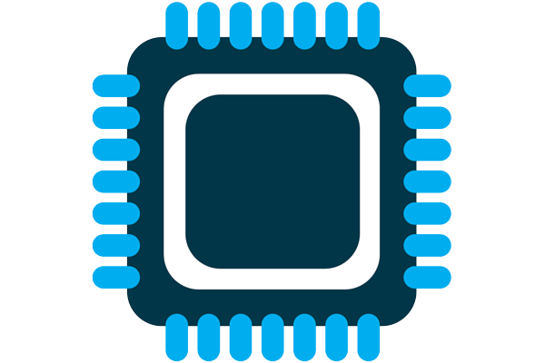

 

  

  <h3 align="center">Simple-ARM-Microprocessor</h3>

  

    A Simple ARM Based Microprocessor Designed in Quartus for CME341
     
  

## Getting Started
To build this project, open and load the files into Quartus and compile it to the board. To test run Model Sim window with following libraries: altera_ver, altera_mf_ver, cycloneive_ver

### Basic Parts
* Intel Altera DE2-115 Cyclone IVE Development Board

### Software Used
* [Quartus Prime 20.1](https://www.intel.com/content/www/us/en/software-kit/660907/intel-quartus-prime-lite-edition-design-software-version-20-1-1-for-windows.html)
* [ModelSim-Intel FGPA](https://www.intel.com/content/www/us/en/software-kit/750368/modelsim-intel-fpgas-standard-edition-software-version-18-1.html)

